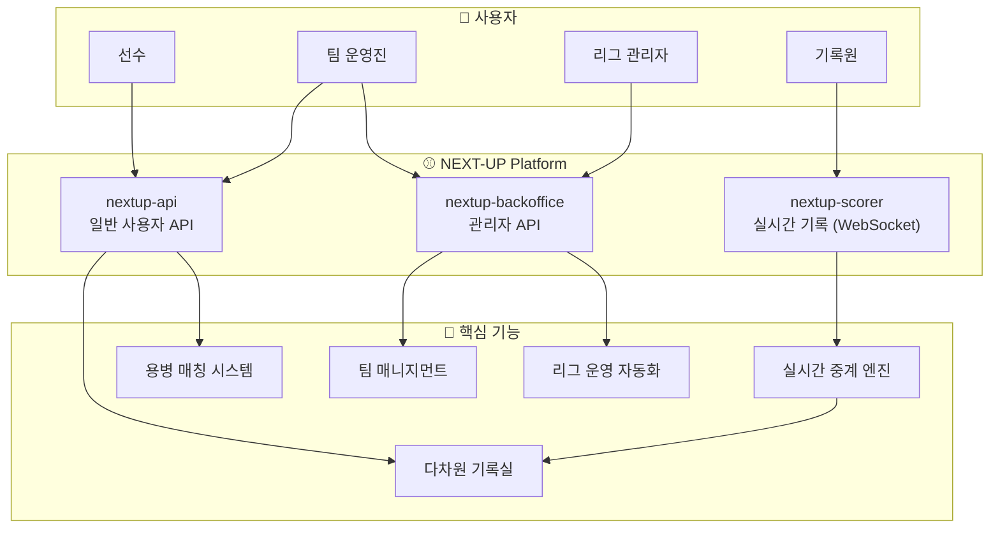
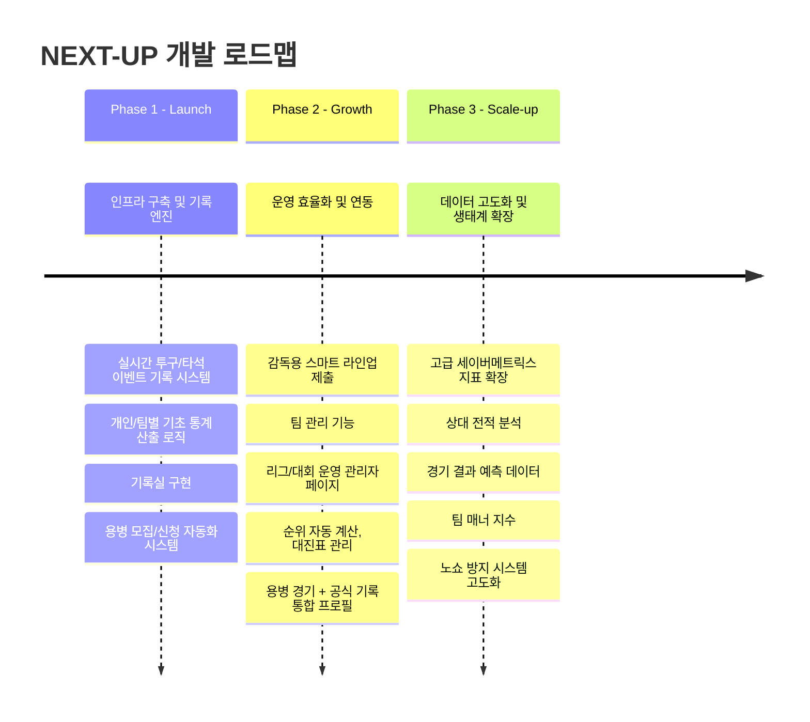

# ⚾️ NEXT-UP: 사회인 야구 통합 플랫폼

> **Next Generation Baseball Data System**  
> 아날로그 사회인 야구를 디지털 야구 생태계로 전환하는 통합 운영 플랫폼

---

## 🎯 프로젝트 비전

**NEXT-UP**은 사회인 야구의 모든 활동을 **데이터 기반 생태계**로 통합하는 플랫폼입니다.

| 항목 | 내용 |
|------|------|
| **목표** | 프로 야구 수준의 실시간 경기 기록 + 자동화된 운영 관리 시스템 제공 |
| **대상** | 사회인 야구 선수, 팀 운영진(감독), 리그/협회 관리자, 용병 활동자 |
| **핵심 문제** | 수기 기록, 게시판 기반 용병 매칭, 반복적인 수동 관리 업무 |

---

## 💡 핵심 가치 (Core Values)

```
┌─────────────────────────────────────────────────────────┐
│                                                         │
│   🔴 LIVE        🔵 INTEGRATED       🟢 AUTOMATED       │
│   실시간           통합                자동화            │
│                                                         │
│   경기 중 발생하는  개인 기록, 팀 관리,   반복적인 수동     │
│   모든 이벤트를     대회 운영, 용병 매칭   관리 업무의      │
│   즉각 데이터화     하나의 파이프라인     완전 자동화       │
│                                                         │
└─────────────────────────────────────────────────────────┘
```

---

## 🏗️ 서비스 아키텍처

### 시스템 구성도



---

## 📋 주요 기능 상세

### 1️⃣ 실시간 경기 중계 및 기록 시스템 (Live Data Engine)

> 현장 기록원의 입력을 **프로 야구 수준의 중계 환경**으로 변환

| 기능 | 설명 |
|------|------|
| **문자 중계** | 투구별 결과(볼, 스트라이크, 파울, 타격 결과)를 실시간 텍스트&그래픽 중계 |
| **이벤트 로그** | "3구째 헛스윙 삼진", "1사 2루 적시타" 등 모든 상황을 타임라인 보존 |
| **즉각 스탯 연산** | 안타/삼진 입력 즉시 → 당일 성적 + 실시간 시즌 타율 계산 및 노출 |

```
[기록원 입력] → [이벤트 처리] → [스탯 연산] → [실시간 중계 화면]
     ⬇️              ⬇️              ⬇️              ⬇️
   투구 결과      타임라인 저장    개인/팀 기록     문자 중계 송출
```

---

### 2️⃣ 다차원 개인/팀 기록실 (Player & Team Stats)

> 투수/타자 기록을 정교하게 분리, **모든 데이터 자동 누적**

#### 타자 기록
| 지표 | 설명 |
|------|------|
| 타율 (AVG) | 안타 / 타수 |
| OPS | 출루율 + 장타율 |
| 타점 (RBI) | 득점 기여 |
| 득점 (R) | 홈 베이스 통과 |
| 도루 (SB) | 도루 성공 |

#### 투수 기록
| 지표 | 설명 |
|------|------|
| ERA | 평균자책점 (9이닝 기준) |
| WHIP | 이닝당 출루 허용 |
| K/9 | 9이닝당 탈삼진 |
| P/IP | 이닝당 투구수 |

#### 필터링 옵션
- 📅 **통산** / **시즌** / **대회별** 기록 조회
- 📊 **박스스코어 자동 생성** - 경기 종료 시 공식 기록지 수준 아카이빙

---

### 3️⃣ 용병 게임 자동화 시스템 (Mercenary Matching)

> 기존 게시판 방식 → **원클릭 모집/신청 + 공식 데이터화**

#### 기존 문제점
```
❌ 게시글 작성 → 댓글 확인 → 수동 명단 수정 → 반복...
❌ 용병 참여 기록 = 공식 기록 불가능
❌ 노쇼, 연락 두절 등 신뢰 문제
```

#### NEXT-UP 솔루션

| 기능 | 설명 |
|------|------|
| **원클릭 모집** | 일시, 장소, 필요 포지션(투수 1, 내야수 2 등) 설정 |
| **원클릭 신청** | 선착순/승인 방식으로 **실시간 명단 자동 갱신** |
| **용병 기록 연동** | 실시간 기록 가능, '용병 경기 전역' 기록으로 별도 관리 |
| **활동 히스토리** | 용병 이력 = 신뢰도 증명 자료 |

---

### 4️⃣ 팀 매니지먼트 솔루션 (Team Admin Tools)

> 감독/운영진의 **행정 업무 획기적 감소**

| 기능 | 설명 |
|------|------|
| **스마트 라인업** | 드래그 앤 드롭으로 타순 편성 → 협회/상대팀에 디지털 전송 |
| **팀 전력 분석** | 선수 컨디션, 포지션별 숙련도, 상대팀 역대 전적 시각화 |
| **활동 관리** | 경기/연습 일정 투표 + 출석 체크 연동 |

---

### 5️⃣ 대회 및 리그 운영 자동화 (League Administration)

> 리그 운영사의 **운영 효율 극대화**

| 기능 | 설명 |
|------|------|
| **실시간 순위 산정** | 경기 결과 확정 즉시 → 승률/승점/득실차 자동 계산 |
| **대진표 자동 생성** | 리그전/토너먼트 방식별 대진표 및 일정 관리 |
| **부정 선수 방지** | 등록 로스터 ↔ 실시간 라인업 대조, 미등록 선수 출전 시스템 차단 |

---

## 🗺️ 개발 로드맵



### Phase 1: Launch (인프라 구축 및 기록 엔진)

- [x] 프로젝트 기본 구조 설정
- [ ] 실시간 투구/타석 이벤트 기록 시스템 개발
- [ ] 개인/팀별 기초 통계 산출 로직 및 기록실 구현
- [ ] 용병 모집/신청 자동화 시스템 (게시판 방식 대체)

### Phase 2: Growth (운영 효율화 및 연동)

- [ ] 감독용 스마트 라인업 제출 및 팀 관리 기능
- [ ] 리그/대회 운영 관리자 페이지 (순위 자동 계산, 대진표 관리)
- [ ] 용병 경기와 공식 기록의 통합 프로필 관리

### Phase 3: Scale-up (데이터 고도화 및 생태계 확장)

- [ ] 고급 세이버메트릭스(전문 통계) 지표 확장
- [ ] 상대 전적 분석 및 경기 결과 예측 데이터 제공
- [ ] 팀 매너 지수 및 노쇼 방지 시스템 고도화

---

## 📈 기대 효과

### 사용자 관점

| 대상 | 기대 효과 |
|------|-----------|
| **선수** | 모든 플레이가 프로처럼 기록되는 경험 → 높은 만족도와 충성도 |
| **운영자** | 반복 수동 작업(명단 수정, 결과 집계)에서 해방 → 핵심 운영 집중 |
| **플랫폼** | 용병 매칭으로 평일/비시즌에도 유입 지속 → 강력한 네트워크 효과 |

### 비즈니스 관점

```
┌─────────────────────────────────────────────────────────┐
│                   NEXT-UP 가치 창출                      │
├─────────────────────────────────────────────────────────┤
│                                                         │
│  선수 데이터 축적  ←→  팀 운영 효율화  ←→  리그 신뢰도 향상  │
│        ↓                    ↓                    ↓       │
│   개인 기록 관리       자동화된 관리       부정 선수 방지    │
│   용병 신뢰도 증명     전력 분석 도구      실시간 순위 산정  │
│                                                         │
│                    ⬇️ 네트워크 효과 ⬇️                   │
│                                                         │
│           용병 매칭으로 연중 지속적인 플랫폼 활성화          │
│                                                         │
└─────────────────────────────────────────────────────────┘
```

---

## 🔗 관련 문서

| 문서 | 설명 |
|------|------|
| [CLAUDE.md](../CLAUDE.md) | 프로젝트 헌법 (기술 규칙, 아키텍처 원칙) |
| [prompt.md](../prompt.md) | 에이전트 시스템 설계 |

---

<div align="center">

**NEXT-UP** - *Because Every Play Deserves to be Recorded*

⚾️ 모든 플레이가 기록될 자격이 있습니다.

</div>
