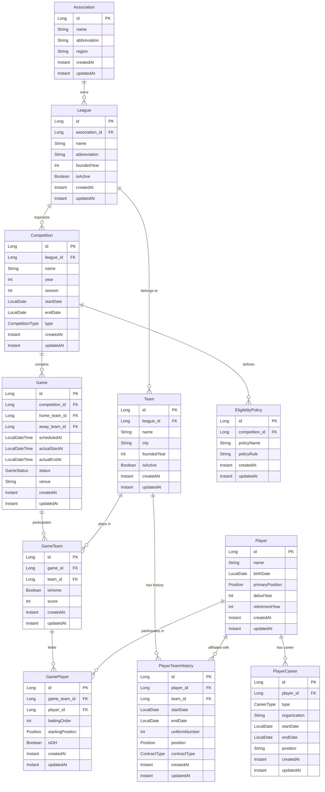

# 구현 브리프: Phase 1 기초 도메인 모델링

## 1. 요구사항 요약

### 1.1 원본 요청
- NEXT-UP 사회인 야구 실시간 기록 및 매니지먼트 시스템 백엔드 개발
- 한국 사회인 야구의 복잡한 1~4부 리그 체계 및 대회별 선수 출신(선출) 제약 조건을 실시간 검증하고 기록하는 엔진 구축

### 1.2 Phase 1 구현 범위
- **기초 도메인 엔티티 설계**: Association → Competition → Game → Team → Player 계층 구조
- **선수 경력 관리**: 학교, 경력 시작/종료일 저장하여 '선출 여부' 판별 기초 데이터 구축
- **대회별 정책 확장성**: Competition이 고유한 EligibilityPolicy를 가질 수 있는 구조 설계
- **경기 규칙 주입**: 2025 KBO 규정 베이스라인 + 사회인 야구 로컬 룰 주입 가능 구조

### 1.3 해석된 범위 (Phase 1)
- 기존 엔티티(League, Team, Player, PlayerTeamHistory) 분석 완료
- 누락된 핵심 도메인 추가: **Association**, **Competition**, **Game**, **PlayerCareer**
- Player와 Competition 간 느슨한 결합(Decoupling) 설계
- 향후 동적 자격 제한 로직 추가 시 구조 변경 최소화

---

## 2. 기존 도메인 분석

### 2.1 현재 엔티티 구조

```
League (리그)
  └─ Team (팀)
       └─ PlayerTeamHistory (선수-팀 이력)
            └─ Player (선수)
```

### 2.2 기존 엔티티 평가

| 엔티티 | 역할 | 평가 |
|--------|------|------|
| `League` | 리그 관리 (KBO, 사회인 야구 리그 등) | **문제**: 사회인 야구의 '협회(Association)' 개념 부재 |
| `Team` | 팀 정보 관리 | 양호 |
| `Player` | 선수 기본 정보 | **문제**: 학교 경력, 선출 여부 판별 데이터 부재 |
| `PlayerTeamHistory` | 선수-팀 소속 이력 | 양호 (M:N 관계 해소, 이력 정보 저장) |

### 2.3 도메인 누락 사항

1. **Association (협회)**: 사회인 야구는 여러 협회(예: 서울시 야구협회, 경기도 야구협회)가 존재하며, 각 협회는 독립적인 리그 체계를 운영
2. **Competition (대회)**: 리그 내 시즌별 대회 (예: 2025년 1부 리그, 2부 리그)
3. **Game (경기)**: 대회 내 실제 경기 기록
4. **PlayerCareer (선수 경력)**: 학교 경력, 사회인 야구 경력 등 '선출 여부' 판별 기초 데이터
5. **EligibilityPolicy (자격 정책)**: 대회별 선수 출전 자격 제한 규칙 (향후 확장)

---

## 3. ERD 초안 (Phase 1)

### 3.1 전체 계층 구조

```
Association (협회)
  └─ League (리그)
       └─ Competition (대회)
            ├─ Game (경기)
            │    ├─ GameTeam (경기-팀)
            │    │    └─ GamePlayer (경기-선수)
            │    └─ GameEvent (경기 이벤트)
            └─ EligibilityPolicy (자격 정책) [향후 확장]

Team (팀)
  └─ PlayerTeamHistory (선수-팀 이력)
       └─ Player (선수)
            └─ PlayerCareer (선수 경력)
```

### 3.2 핵심 엔티티 관계도 (Mermaid)



### 3.3 새로 추가할 엔티티 상세

#### 3.3.1 Association (협회)

```kotlin
@Entity
@Table(name = "associations")
class Association(
    @Column(nullable = false, length = 100)
    val name: String,

    @Column(length = 20)
    val abbreviation: String? = null,

    @Column(length = 50)
    val region: String? = null,

    @Column(length = 500)
    var description: String? = null,

    @Column(nullable = false)
    var isActive: Boolean = true,

    @Id
    @GeneratedValue(strategy = GenerationType.IDENTITY)
    val id: Long = 0L
) : BaseTimeEntity() {

    @OneToMany(mappedBy = "association", fetch = FetchType.LAZY)
    private val _leagues: MutableList<League> = mutableListOf()
    val leagues: List<League> get() = _leagues.toList()

    fun addLeague(league: League) {
        _leagues.add(league)
    }
}
```

#### 3.3.2 Competition (대회)

```kotlin
@Entity
@Table(
    name = "competitions",
    indexes = [
        Index(name = "idx_competitions_league_year", columnList = "league_id, year"),
        Index(name = "idx_competitions_dates", columnList = "start_date, end_date")
    ]
)
class Competition(
    @ManyToOne(fetch = FetchType.LAZY)
    @JoinColumn(name = "league_id", nullable = false)
    val league: League,

    @Column(nullable = false, length = 100)
    val name: String,

    @Column(nullable = false)
    val year: Int,

    @Column(nullable = false)
    val season: Int = 1,

    @Column(name = "start_date", nullable = false)
    val startDate: LocalDate,

    @Column(name = "end_date")
    var endDate: LocalDate? = null,

    @Enumerated(EnumType.STRING)
    @Column(nullable = false, length = 30)
    val type: CompetitionType = CompetitionType.LEAGUE,

    @Column(length = 500)
    var description: String? = null,

    @Id
    @GeneratedValue(strategy = GenerationType.IDENTITY)
    val id: Long = 0L
) : BaseTimeEntity() {

    @OneToMany(mappedBy = "competition", fetch = FetchType.LAZY)
    private val _games: MutableList<Game> = mutableListOf()
    val games: List<Game> get() = _games.toList()

    val isActive: Boolean
        get() = endDate == null || endDate!!.isAfter(LocalDate.now())

    fun addGame(game: Game) {
        _games.add(game)
    }
}

enum class CompetitionType(val displayName: String) {
    LEAGUE("리그"),
    TOURNAMENT("토너먼트"),
    PLAYOFF("플레이오프"),
    CHAMPIONSHIP("챔피언십")
}
```

#### 3.3.3 Game (경기)

```kotlin
@Entity
@Table(
    name = "games",
    indexes = [
        Index(name = "idx_games_competition", columnList = "competition_id"),
        Index(name = "idx_games_scheduled_at", columnList = "scheduled_at"),
        Index(name = "idx_games_status", columnList = "status")
    ]
)
class Game(
    @ManyToOne(fetch = FetchType.LAZY)
    @JoinColumn(name = "competition_id", nullable = false)
    val competition: Competition,

    @Column(name = "scheduled_at", nullable = false)
    val scheduledAt: LocalDateTime,

    @Column(length = 100)
    val venue: String? = null,

    @Column(name = "actual_start_at")
    var actualStartAt: LocalDateTime? = null,

    @Column(name = "actual_end_at")
    var actualEndAt: LocalDateTime? = null,

    @Enumerated(EnumType.STRING)
    @Column(nullable = false, length = 20)
    var status: GameStatus = GameStatus.SCHEDULED,

    @Column(length = 500)
    var notes: String? = null,

    @Id
    @GeneratedValue(strategy = GenerationType.IDENTITY)
    val id: Long = 0L
) : BaseTimeEntity() {

    @OneToMany(mappedBy = "game", fetch = FetchType.LAZY, cascade = [CascadeType.ALL])
    private val _gameTeams: MutableList<GameTeam> = mutableListOf()
    val gameTeams: List<GameTeam> get() = _gameTeams.toList()

    val homeTeam: GameTeam?
        get() = _gameTeams.find { it.isHome }

    val awayTeam: GameTeam?
        get() = _gameTeams.find { !it.isHome }

    fun startGame() {
        require(status == GameStatus.SCHEDULED) { "경기는 예정 상태에서만 시작할 수 있습니다." }
        actualStartAt = LocalDateTime.now()
        status = GameStatus.IN_PROGRESS
    }

    fun endGame() {
        require(status == GameStatus.IN_PROGRESS) { "진행 중인 경기만 종료할 수 있습니다." }
        actualEndAt = LocalDateTime.now()
        status = GameStatus.COMPLETED
    }

    fun cancelGame() {
        status = GameStatus.CANCELLED
    }
}

enum class GameStatus(val displayName: String) {
    SCHEDULED("예정"),
    IN_PROGRESS("진행 중"),
    COMPLETED("완료"),
    CANCELLED("취소"),
    POSTPONED("연기")
}
```

#### 3.3.4 GameTeam (경기-팀)

```kotlin
@Entity
@Table(
    name = "game_teams",
    indexes = [
        Index(name = "idx_game_teams_game", columnList = "game_id"),
        Index(name = "idx_game_teams_team", columnList = "team_id")
    ]
)
class GameTeam(
    @ManyToOne(fetch = FetchType.LAZY)
    @JoinColumn(name = "game_id", nullable = false)
    val game: Game,

    @ManyToOne(fetch = FetchType.LAZY)
    @JoinColumn(name = "team_id", nullable = false)
    val team: Team,

    @Column(name = "is_home", nullable = false)
    val isHome: Boolean,

    @Column(nullable = false)
    var score: Int = 0,

    @Id
    @GeneratedValue(strategy = GenerationType.IDENTITY)
    val id: Long = 0L
) : BaseTimeEntity() {

    @OneToMany(mappedBy = "gameTeam", fetch = FetchType.LAZY, cascade = [CascadeType.ALL])
    private val _gamePlayers: MutableList<GamePlayer> = mutableListOf()
    val gamePlayers: List<GamePlayer> get() = _gamePlayers.toList()

    fun addPlayer(gamePlayer: GamePlayer) {
        _gamePlayers.add(gamePlayer)
    }

    fun updateScore(newScore: Int) {
        require(newScore >= 0) { "점수는 0 이상이어야 합니다." }
        this.score = newScore
    }
}
```

#### 3.3.5 GamePlayer (경기-선수)

```kotlin
@Entity
@Table(
    name = "game_players",
    indexes = [
        Index(name = "idx_game_players_game_team", columnList = "game_team_id"),
        Index(name = "idx_game_players_player", columnList = "player_id"),
        Index(name = "idx_game_players_batting_order", columnList = "game_team_id, batting_order")
    ]
)
class GamePlayer(
    @ManyToOne(fetch = FetchType.LAZY)
    @JoinColumn(name = "game_team_id", nullable = false)
    val gameTeam: GameTeam,

    @ManyToOne(fetch = FetchType.LAZY)
    @JoinColumn(name = "player_id", nullable = false)
    val player: Player,

    @Column(name = "batting_order")
    var battingOrder: Int? = null,

    @Enumerated(EnumType.STRING)
    @Column(name = "starting_position", length = 30)
    var startingPosition: Position? = null,

    @Column(name = "is_dh", nullable = false)
    var isDH: Boolean = false,

    @Column(name = "is_starter", nullable = false)
    var isStarter: Boolean = true,

    @Id
    @GeneratedValue(strategy = GenerationType.IDENTITY)
    val id: Long = 0L
) : BaseTimeEntity() {

    fun validateDH() {
        if (isDH) {
            require(startingPosition == Position.DESIGNATED_HITTER || startingPosition == null) {
                "DH는 지명타자 포지션이어야 합니다."
            }
        }
    }
}
```

#### 3.3.6 PlayerCareer (선수 경력)

```kotlin
@Entity
@Table(
    name = "player_careers",
    indexes = [
        Index(name = "idx_player_careers_player", columnList = "player_id"),
        Index(name = "idx_player_careers_type", columnList = "career_type"),
        Index(name = "idx_player_careers_dates", columnList = "player_id, start_date, end_date")
    ]
)
class PlayerCareer(
    @ManyToOne(fetch = FetchType.LAZY)
    @JoinColumn(name = "player_id", nullable = false)
    val player: Player,

    @Enumerated(EnumType.STRING)
    @Column(name = "career_type", nullable = false, length = 30)
    val type: CareerType,

    @Column(nullable = false, length = 100)
    val organization: String,

    @Column(name = "start_date", nullable = false)
    val startDate: LocalDate,

    @Column(name = "end_date")
    var endDate: LocalDate? = null,

    @Column(length = 50)
    val position: String? = null,

    @Column(length = 500)
    var description: String? = null,

    @Id
    @GeneratedValue(strategy = GenerationType.IDENTITY)
    val id: Long = 0L
) : BaseTimeEntity() {

    val isActive: Boolean
        get() = endDate == null

    fun endCareer(date: LocalDate) {
        require(date >= startDate) { "종료일은 시작일 이후여야 합니다." }
        this.endDate = date
    }

    fun isActiveAt(date: LocalDate): Boolean {
        return !startDate.isAfter(date) && (endDate == null || !endDate!!.isBefore(date))
    }

    /**
     * 선출 여부 판별 기초 로직
     * 추후 EligibilityPolicy와 연동하여 동적 검증 가능
     */
    fun isEligibleForCompetition(competitionDate: LocalDate): Boolean {
        return when (type) {
            CareerType.PROFESSIONAL -> false // 프로 출신은 일반적으로 제한
            CareerType.HIGH_SCHOOL, CareerType.UNIVERSITY -> {
                // 학교 경력은 종료 후 일정 기간 경과 시 허용 (정책에 따라 다름)
                endDate?.let { it.isBefore(competitionDate.minusYears(1)) } ?: false
            }
            CareerType.AMATEUR -> true // 순수 아마추어는 허용
        }
    }
}

enum class CareerType(val displayName: String) {
    PROFESSIONAL("프로"),
    HIGH_SCHOOL("고등학교"),
    UNIVERSITY("대학교"),
    AMATEUR("아마추어")
}
```

#### 3.3.7 EligibilityPolicy (자격 정책) - Phase 2 확장 대비

```kotlin
/**
 * Phase 2에서 본격 구현 예정
 * Phase 1에서는 스키마만 정의하여 확장성 확보
 */
@Entity
@Table(
    name = "eligibility_policies",
    indexes = [
        Index(name = "idx_eligibility_policies_competition", columnList = "competition_id")
    ]
)
class EligibilityPolicy(
    @ManyToOne(fetch = FetchType.LAZY)
    @JoinColumn(name = "competition_id", nullable = false)
    val competition: Competition,

    @Column(name = "policy_name", nullable = false, length = 100)
    val policyName: String,

    @Column(name = "policy_rule", columnDefinition = "TEXT")
    val policyRule: String, // JSON 또는 DSL 형태로 저장

    @Id
    @GeneratedValue(strategy = GenerationType.IDENTITY)
    val id: Long = 0L
) : BaseTimeEntity()
```

---

## 4. Player와 Competition 간 느슨한 결합(Decoupling) 방안

### 4.1 현재 문제점
- Player와 Competition이 직접 연관되면 대회별 정책 변경 시 Player 엔티티 수정 필요
- 대회별 동적 자격 제한 규칙 적용 어려움

### 4.2 해결 방안: Strategy Pattern + Policy Engine

```kotlin
// 1. 자격 검증 인터페이스 (Port)
interface EligibilityValidator {
    fun validate(player: Player, competition: Competition): ValidationResult
}

// 2. 검증 결과
data class ValidationResult(
    val isEligible: Boolean,
    val violations: List<String> = emptyList()
) {
    companion object {
        fun eligible(): ValidationResult = ValidationResult(true)
        fun ineligible(vararg violations: String): ValidationResult =
            ValidationResult(false, violations.toList())
    }
}

// 3. 기본 검증기 (nextup-core)
class DefaultEligibilityValidator : EligibilityValidator {
    override fun validate(player: Player, competition: Competition): ValidationResult {
        val violations = mutableListOf<String>()

        // 기본 규칙: 프로 출신 제한
        val proCareer = player.careers.find { it.type == CareerType.PROFESSIONAL }
        if (proCareer != null) {
            violations.add("프로 출신 선수는 해당 대회에 출전할 수 없습니다.")
        }

        return if (violations.isEmpty()) {
            ValidationResult.eligible()
        } else {
            ValidationResult.ineligible(*violations.toTypedArray())
        }
    }
}

// 4. 정책 기반 검증기 (향후 확장)
class PolicyBasedEligibilityValidator(
    private val policyEngine: PolicyEngine
) : EligibilityValidator {
    override fun validate(player: Player, competition: Competition): ValidationResult {
        val policies = policyEngine.getPoliciesForCompetition(competition)
        return policyEngine.evaluate(player, policies)
    }
}
```

### 4.3 사용 예시

```kotlin
// Service Layer (nextup-infra)
class CompetitionService(
    private val eligibilityValidator: EligibilityValidator
) {
    fun registerPlayerForCompetition(player: Player, competition: Competition) {
        val result = eligibilityValidator.validate(player, competition)

        if (!result.isEligible) {
            throw PlayerIneligibleException(result.violations)
        }

        // 등록 로직...
    }
}
```

---

## 5. 패키지 구조 제안

### 5.1 nextup-core 패키지 구조

```
com.nextup.core
├── common
│   └── BaseTimeEntity.kt
├── domain
│   ├── association
│   │   └── Association.kt
│   ├── league
│   │   ├── League.kt
│   │   └── Competition.kt
│   ├── team
│   │   └── Team.kt
│   ├── player
│   │   ├── Player.kt
│   │   ├── PlayerTeamHistory.kt
│   │   ├── PlayerCareer.kt
│   │   ├── Position.kt
│   │   ├── ContractType.kt
│   │   ├── CareerType.kt
│   │   ├── ThrowingHand.kt
│   │   └── BattingHand.kt
│   ├── game
│   │   ├── Game.kt
│   │   ├── GameTeam.kt
│   │   ├── GamePlayer.kt
│   │   ├── GameStatus.kt
│   │   └── GameEvent.kt (향후 추가)
│   └── eligibility
│       ├── EligibilityPolicy.kt
│       ├── EligibilityValidator.kt (interface)
│       ├── DefaultEligibilityValidator.kt
│       └── ValidationResult.kt
└── port
    ├── AssociationRepository.kt
    ├── CompetitionRepository.kt
    ├── GameRepository.kt
    ├── PlayerCareerRepository.kt
    └── PolicyEngine.kt (interface, Phase 2)
```

### 5.2 nextup-infrastructure 패키지 구조

```
com.nextup.infrastructure
├── persistence
│   ├── association
│   │   ├── AssociationJpaRepository.kt
│   │   └── AssociationRepositoryImpl.kt
│   ├── competition
│   │   ├── CompetitionJpaRepository.kt
│   │   └── CompetitionRepositoryImpl.kt
│   ├── game
│   │   ├── GameJpaRepository.kt
│   │   ├── GameTeamJpaRepository.kt
│   │   ├── GamePlayerJpaRepository.kt
│   │   └── GameRepositoryImpl.kt
│   └── player
│       ├── PlayerCareerJpaRepository.kt
│       └── PlayerCareerRepositoryImpl.kt
└── policy (Phase 2)
    └── JsonPolicyEngine.kt
```

### 5.3 nextup-api 패키지 구조

```
com.nextup.api
├── controller
│   ├── AssociationController.kt
│   ├── CompetitionController.kt
│   ├── GameController.kt
│   └── PlayerController.kt
├── dto
│   ├── association
│   │   ├── AssociationRequest.kt
│   │   └── AssociationResponse.kt
│   ├── competition
│   │   ├── CompetitionRequest.kt
│   │   └── CompetitionResponse.kt
│   ├── game
│   │   ├── GameRequest.kt
│   │   ├── GameResponse.kt
│   │   └── GamePlayerRequest.kt
│   └── player
│       ├── PlayerCareerRequest.kt
│       └── PlayerCareerResponse.kt
└── exception
    ├── CompetitionNotFoundException.kt
    ├── PlayerIneligibleException.kt
    └── GameNotFoundException.kt
```

---

## 6. 의존성 영향도

### 6.1 기존 모듈 간 의존성 변경 여부
**변경 없음**. 기존 의존성 규칙 준수:
- `nextup-api` → `nextup-infrastructure`, `nextup-core`, `nextup-common`
- `nextup-infrastructure` → `nextup-core`, `nextup-common`
- `nextup-core` → `nextup-common`

### 6.2 신규 외부 라이브러리
**Phase 1에서는 추가 라이브러리 불필요**. 기존 스택 활용:
- Spring Data JPA (이미 사용 중)
- PostgreSQL + PostGIS (이미 사용 중)

**Phase 2 확장 시 고려사항**:
- JSON 정책 파싱을 위한 `kotlinx-serialization` 또는 `Jackson`
- 복잡한 규칙 엔진이 필요한 경우 `Drools` 또는 `Easy Rules` 고려

---

## 7. 리스크 및 고려사항

### 7.1 기술적 리스크

| 리스크 | 영향도 | 완화 방안 |
|--------|--------|-----------|
| **대회별 정책의 동적 변경** | High | Phase 1에서 인터페이스 기반 설계로 확장성 확보, Phase 2에서 PolicyEngine 구현 |
| **선수 자격 검증 성능** | Medium | PlayerCareer에 인덱스 추가 (`idx_player_careers_dates`), 캐싱 전략 고려 |
| **경기 중 동시성 이슈** | Medium | GamePlayer 등록 시 낙관적 락(`@Version`) 적용 고려 |
| **순환 참조 위험** | Low | ERD에서 단방향 관계 유지, `@JsonIgnore` 또는 DTO 변환 철저 |

### 7.2 도메인 리스크

| 리스크 | 영향도 | 완화 방안 |
|--------|--------|-----------|
| **야구 규칙의 복잡성** | High | `baseball-expert` Agent와 긴밀히 협업, 규칙 변경 시 별도 테스트 케이스 작성 |
| **선출 여부 판별 기준 모호성** | High | Phase 1에서 기초 데이터만 저장, Phase 2에서 협회/리그별 정책 정의 |
| **DH 규칙 해제 처리** | Medium | GamePlayer에 `isDH` 플래그 추가, 경기 중 포지션 변경 이벤트 기록 (Phase 2) |

### 7.3 확장성 고려사항

1. **GameEvent 엔티티 추가 (Phase 2)**
   - 타석, 투구, 수비 교체 등 세밀한 경기 이벤트 기록
   - Event Sourcing 패턴 적용 고려

2. **PlayerStatistics 집계**
   - GamePlayer 데이터를 기반으로 타율, ERA 등 통계 산출
   - CQRS 패턴 적용하여 읽기 성능 최적화

3. **Multi-Tenancy 지원**
   - Association 단위로 데이터 격리 필요 시 고려

---

## 8. 예상 작업 할당

### 8.1 modeler (Core Entity 개발)
- [ ] `Association` 엔티티 구현
- [ ] `Competition` 엔티티 구현
- [ ] `Game`, `GameTeam`, `GamePlayer` 엔티티 구현
- [ ] `PlayerCareer` 엔티티 구현
- [ ] `EligibilityPolicy` 스키마 정의 (Phase 2 대비)
- [ ] `EligibilityValidator` 인터페이스 및 기본 구현체 작성
- [ ] `League` 엔티티에 `association` 관계 추가
- [ ] `Player` 엔티티에 `careers` 관계 추가
- [ ] 도메인 로직 단위 테스트 작성

### 8.2 logic-broker (Infrastructure 구현)
- [ ] `AssociationRepository` 인터페이스 및 구현체
- [ ] `CompetitionRepository` 인터페이스 및 구현체
- [ ] `GameRepository` 인터페이스 및 구현체 (GameTeam, GamePlayer 포함)
- [ ] `PlayerCareerRepository` 인터페이스 및 구현체
- [ ] JPA 쿼리 메서드 최적화 (N+1 방지, fetch join)
- [ ] Repository 통합 테스트 작성 (`@DataJpaTest`)

### 8.3 api-specialist (API Layer 개발)
- [ ] `AssociationController` 및 DTO 작성
- [ ] `CompetitionController` 및 DTO 작성
- [ ] `GameController` 및 DTO 작성
- [ ] `PlayerController`에 경력 관리 API 추가
- [ ] 예외 처리: `CompetitionNotFoundException`, `PlayerIneligibleException`, `GameNotFoundException`
- [ ] API 명세 문서 작성 (Swagger/OpenAPI)
- [ ] Controller 통합 테스트 작성 (`@WebMvcTest`)

### 8.4 data-transformer (DTO Mapper 개발)
- [ ] Association 도메인 ↔ DTO 변환 로직
- [ ] Competition 도메인 ↔ DTO 변환 로직
- [ ] Game 도메인 ↔ DTO 변환 로직 (중첩 구조 처리)
- [ ] PlayerCareer 도메인 ↔ DTO 변환 로직
- [ ] Entity 노출 방지 검증 (Mapper 단위 테스트)

### 8.5 scenario-tester (시나리오 테스트)
- [ ] 협회 → 리그 → 대회 생성 시나리오
- [ ] 대회 → 경기 생성 및 팀 등록 시나리오
- [ ] 선수 경력 등록 및 자격 검증 시나리오
- [ ] 경기 시작 → 선수 출전 → 경기 종료 시나리오
- [ ] 선출 제한 위반 케이스 테스트 (프로 출신 등)

### 8.6 github-manager (이슈/브랜치 관리)
- [ ] Phase 1 구현을 위한 GitHub 이슈 생성
  - Issue #1: Association 및 Competition 엔티티 구현
  - Issue #2: Game 도메인 구현 (Game, GameTeam, GamePlayer)
  - Issue #3: PlayerCareer 및 EligibilityValidator 구현
  - Issue #4: Repository 및 Infrastructure 레이어 구현
  - Issue #5: API 레이어 및 DTO 구현
  - Issue #6: 통합 테스트 및 시나리오 검증
- [ ] 브랜치 전략 수립 (`feat/phase1-domain-modeling`)

---

## 9. Phase 1 완료 기준 (Definition of Done)

### 9.1 필수 요구사항
- [ ] 모든 신규 엔티티가 `BaseTimeEntity`를 상속하고 Auditing이 동작함
- [ ] `./gradlew build` 성공 (컴파일 에러 없음)
- [ ] 모든 단위 테스트 통과 (JUnit 5 + Kotest)
- [ ] 모든 통합 테스트 통과 (`@DataJpaTest`, `@WebMvcTest`)
- [ ] `reviewer` Agent의 헌법 검사 통과 (의존성 규칙, Entity Leak 방지)

### 9.2 품질 요구사항
- [ ] ktlint 경고 0개 (코드 스타일 준수)
- [ ] detekt potential-bugs 0개
- [ ] API 응답이 모두 `ApiResponse`로 래핑됨
- [ ] 예외 처리가 모두 `CustomException` 기반으로 구현됨
- [ ] `baseball-expert` Agent의 도메인 규칙 검증 통과

### 9.3 문서화 요구사항
- [ ] API 명세 문서 작성 (`outputs/docs/api-spec.md`)
- [ ] ERD 다이어그램 최신화
- [ ] ADR 작성 (Architecture Decision Record): "왜 Association을 별도 엔티티로 분리했는가?"

---

## 10. Phase 2 Preview (향후 확장)

Phase 1 완료 후 다음 기능들을 순차적으로 구현합니다:

1. **PolicyEngine 구현**: JSON 기반 동적 자격 정책 평가
2. **GameEvent 엔티티**: 타석, 투구, 수비 교체 등 세밀한 이벤트 기록
3. **PlayerStatistics 집계**: CQRS 패턴으로 통계 산출 및 조회 최적화
4. **실시간 경기 기록 API**: WebSocket 또는 SSE 기반 실시간 업데이트
5. **DH 규칙 해제 처리**: 경기 중 포지션 변경 이벤트 추적

---

## 11. 결론

본 Brief는 NEXT-UP Phase 1의 기초 도메인 모델링을 위한 완전한 설계 문서입니다.

핵심 전략:
1. **확장성 우선**: Player와 Competition 간 느슨한 결합으로 향후 정책 변경에 유연 대응
2. **Rich Domain**: 비즈니스 로직을 Entity 내부에 캡슐화 (`Game.startGame()`, `PlayerCareer.isEligibleForCompetition()`)
3. **Hexagonal Architecture 준수**: Port(Interface)와 Adapter(Implementation) 분리
4. **Zero Broken Builds**: 모든 커밋은 `./gradlew build` 통과 필수

다음 단계는 `tech-lead`와의 기술 스택 최종 검토 및 `reviewer`의 헌법 검사입니다.

---

**작성일**: 2025-01-21
**작성자**: planner (기획 에이전트)
**검토 대기**: tech-lead, baseball-expert, reviewer
